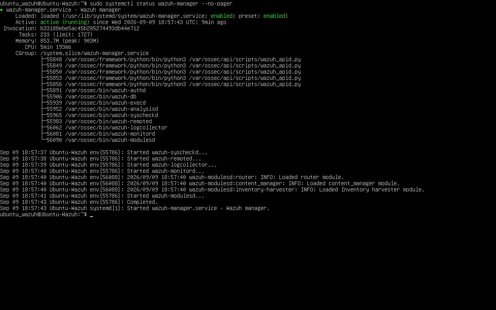
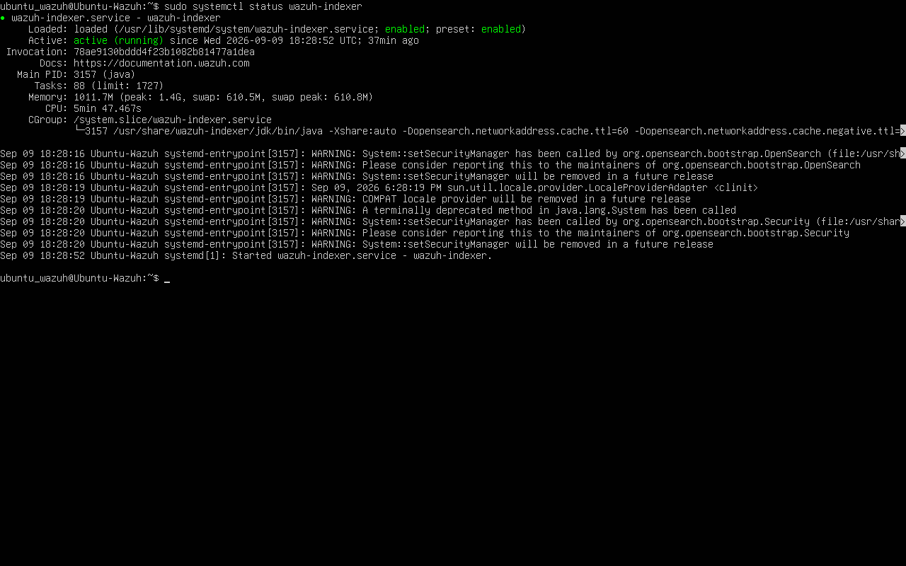
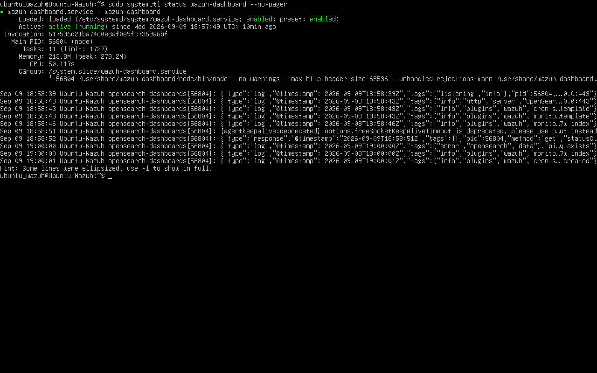
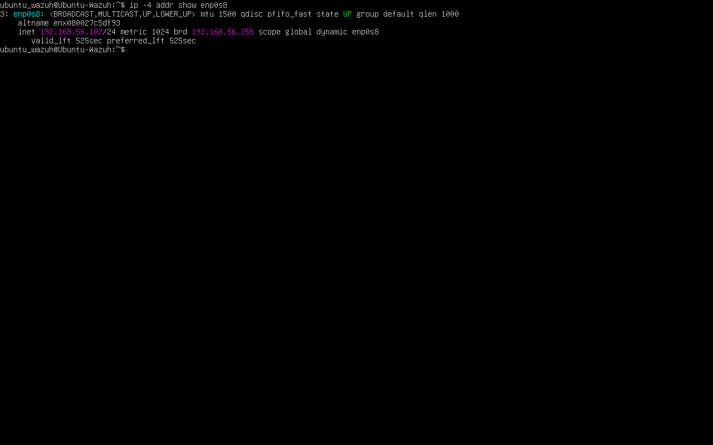
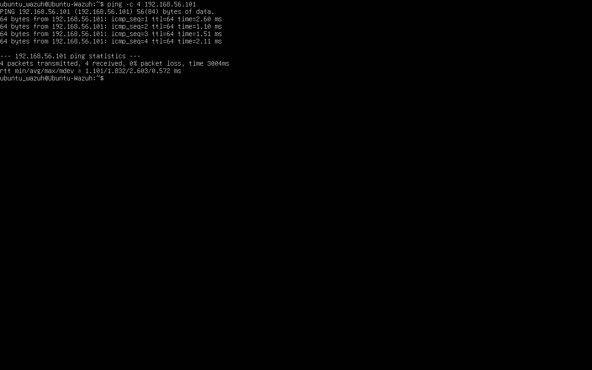
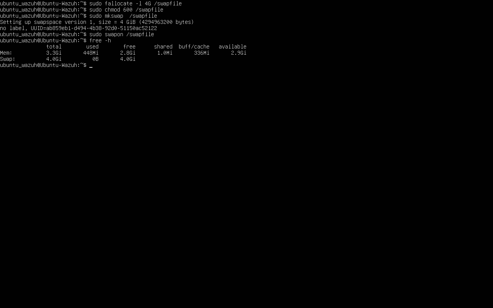
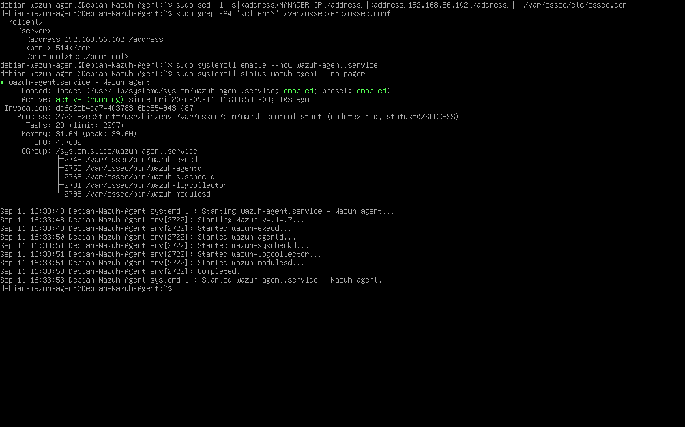
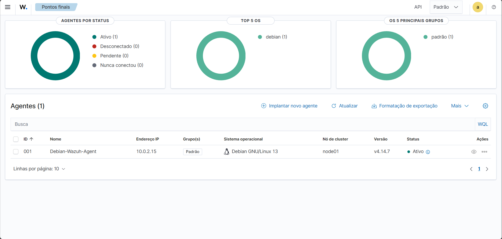
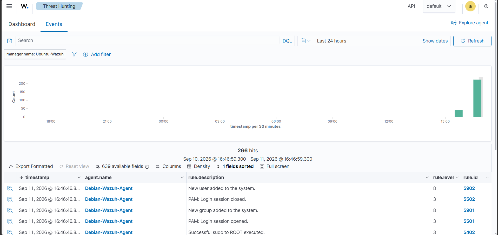
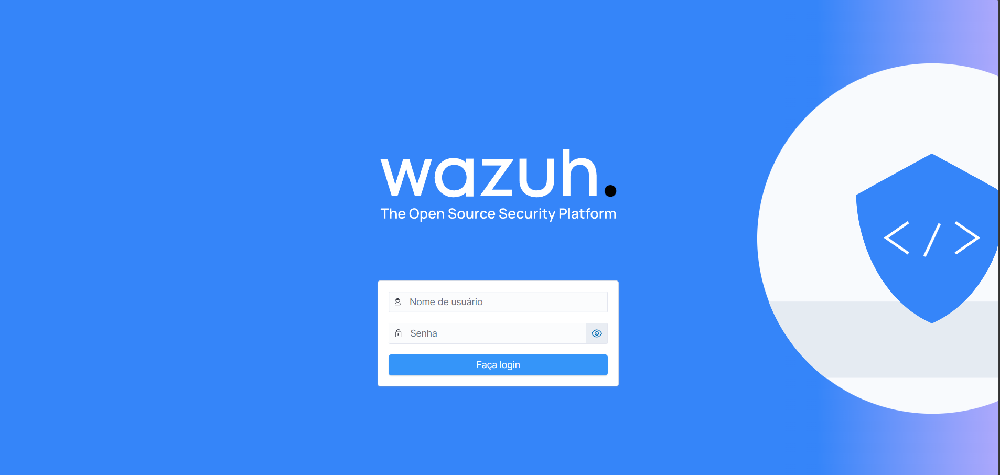

<div align="center">

# 🛡️ Laboratório Wazuh

**SIEM • Blue Team • Monitoramento • Detecção**

[](https://wazuh.com/)
[](https://ubuntu.com/)
[](https://www.debian.org/)
[](https://www.virtualbox.org/)
[](#)

</div>

---

## 🟢 Sobre o laboratório

Este é um laboratório pessoal montado para **praticar segurança defensiva com Wazuh**, desde a instalação do servidor até a coleta e análise de eventos de um endpoint Linux.

O ambiente foi criado no **VirtualBox**, usando uma VM Ubuntu Server como servidor central do Wazuh e uma VM Debian 13 como endpoint com o Wazuh Agent.

A ideia é ter um ambiente pequeno, funcional e fácil de reproduzir para entender na prática o fluxo de um **SIEM**: o endpoint gera eventos, o Agent coleta, o Manager processa e o Dashboard permite consultar e investigar.

Também registrei os problemas que apareceram durante a montagem, principalmente os relacionados ao consumo de memória do Wazuh Indexer.

---

## 🎯 O que eu quis praticar

- Implantar um ambiente Wazuh funcional.
- Configurar o Wazuh Manager.
- Configurar o Wazuh Indexer.
- Configurar o Wazuh Dashboard.
- Validar a Wazuh API.
- Instalar e configurar o Wazuh Agent no Debian 13.
- Estabelecer comunicação entre servidor e endpoint.
- Visualizar eventos no Threat Hunting.
- Realizar testes controlados de detecção.
- Praticar administração Linux, redes, virtualização e troubleshooting.
- Documentar o processo para fins de estudo e portfólio.

---

## 🧭 Resumo do ambiente

| Componente | Função | Endereço |
|---|---|---|
| 🟢 Ubuntu Server | Wazuh Manager / Indexer / Dashboard / API | `192.168.56.102` |
| 🔵 Debian 13 | Wazuh Agent / endpoint | `192.168.56.101` |

> O laboratório usa uma rede Host-only `192.168.56.0/24` entre as VMs.

---

## 🧩 Arquitetura

```text
                         notebook
                            │
                         VirtualBox
                            │
              ┌─────────────┴─────────────┐
              │                           │
              ▼                           ▼
      ┌────────────────┐          ┌────────────────┐
      │  Ubuntu Server │          │    Debian 13   │
      │  Wazuh Server  │          │    Endpoint    │
      │                │          │                │
      │ Manager        │◄─────────┤ Wazuh Agent    │
      │ Indexer        │          │                │
      │ Dashboard      │          │ coleta eventos │
      │ API            │          │                │
      └────────────────┘          └────────────────┘
              │                           │
              └──────── Host-only ────────┘
                    192.168.56.0/24
```

### Endereçamento do laboratório

| Máquina | Função | IP da rede Host-only |
|---|---|---|
| Ubuntu Server | Wazuh Manager / Indexer / Dashboard / API | `192.168.56.102` |
| Debian 13 | Wazuh Agent | `192.168.56.101` |

As máquinas possuem duas interfaces virtuais:

- **NAT:** acesso à internet para instalação e atualização de pacotes.
- **Host-only:** comunicação isolada entre as VMs do laboratório.

> Os endereços `192.168.56.x` utilizados neste projeto pertencem à rede privada Host-only do laboratório.

---

## 💻 Ambiente

### Host físico

- Notebook ASUS Vivobook Go 15
- 8 GB de RAM
- Windows 11

### Virtualização

- Oracle VirtualBox

### VM Ubuntu — servidor Wazuh

- Ubuntu Server 26.04.1 LTS
- 4 vCPUs
- 4 GB RAM
- aproximadamente 49 GB de disco
- 4 GB de swap
- sem ambiente gráfico

### VM Debian — endpoint

- Debian 13
- 2 vCPUs
- 2 GB RAM
- 25 GB de disco
- sem ambiente gráfico

### Software

- Wazuh 4.14.7
- Wazuh Manager
- Wazuh Indexer
- Wazuh Dashboard
- Wazuh API
- Wazuh Agent
- Git
- GitHub

---

## 🛠️ Instalação do servidor Wazuh

O servidor central foi instalado na VM Ubuntu utilizando o instalador all-in-one do Wazuh.

A instalação disponibilizou os principais componentes:

```text
Wazuh Manager
Wazuh Indexer
Wazuh Dashboard
Wazuh API
```

Após a instalação, os serviços foram validados individualmente utilizando o `systemctl`.

### Evidências







---

## 🌐 Configuração de rede

Após a instalação, foi utilizada uma segunda interface de rede em cada VM para criar uma comunicação isolada entre o servidor e o endpoint.

### Ubuntu

```text
192.168.56.102
```

### Debian

```text
192.168.56.101
```

A comunicação foi validada através de testes de conectividade.





---

## 🧠 Ajustes de memória

O equipamento utilizado possui apenas 8 GB de RAM. Durante a implantação do Wazuh, o consumo de memória tornou-se um dos principais obstáculos.

Foram observados:

- alto consumo de RAM;
- travamentos durante o acesso ao Dashboard;
- falhas na inicialização de componentes;
- comportamento instável do Wazuh Indexer.

### Swap

Foi configurada uma área de swap de aproximadamente 4 GB na VM Ubuntu para fornecer uma margem adicional de memória.



### Ajuste do Wazuh Indexer

Para reduzir o consumo de memória do Indexer, o heap da JVM foi ajustado para:

```text
-Xms1g
-Xmx1g
```

O ajuste foi necessário para que o laboratório pudesse continuar funcionando dentro dos recursos disponíveis.

> Esta configuração foi adotada especificamente para o laboratório. Ambientes de produção devem dimensionar os recursos de acordo com a carga e a documentação oficial.

---

## 🛰️ Instalação do Wazuh Agent

Com o servidor estabilizado, o próximo passo foi instalar o agente no Debian 13.

O agente utilizado foi:

```text
Wazuh Agent 4.14.7
```

O endpoint foi configurado para utilizar o Wazuh Manager:

```text
192.168.56.102
```

O serviço foi habilitado e iniciado através do `systemd`.

### Validação

O serviço apresentou:

```text
wazuh-agent.service
Active: active (running)
```



No Dashboard, o endpoint passou a aparecer como ativo.



---

## 🔄 Comunicação

Após a configuração, o fluxo de comunicação passou a funcionar:

```text
Debian 13
    │
    │ Wazuh Agent
    ▼
Wazuh Manager
    │
    ▼
Wazuh Indexer
    │
    ▼
Wazuh Dashboard
```

A presença do endpoint no Dashboard e a chegada dos eventos confirmaram a comunicação entre as máquinas.

---

## 🔎 Threat Hunting

Após a conexão do agente, o Dashboard passou a apresentar eventos provenientes do Debian.

Entre os eventos observados:

- `PAM: Login session opened.`
- `PAM: Login session closed.`
- `Successful sudo to ROOT executed.`
- eventos de Security Configuration Assessment (SCA).

---

## 🧪 Testes

Foram realizados testes controlados no Debian para validar a capacidade de coleta e detecção do Wazuh.

### 1. Sessão PAM

Operações de login e encerramento de sessão geraram eventos como:

```text
PAM: Login session opened.
PAM: Login session closed.
```

### 2. Execução de sudo

Uma operação administrativa com `sudo` gerou:

```text
Successful sudo to ROOT executed.
```

Esse evento demonstra a capacidade do Wazuh de registrar uma ação relacionada à elevação de privilégios.

### 3. Criação de usuário

Foi criado um usuário de teste:

```text
wazuh-teste
```

A alteração foi detectada pelo Wazuh e apresentada no Threat Hunting.

O usuário foi posteriormente removido para não deixar alterações desnecessárias no endpoint.



---

## 🔌 API

A Wazuh API foi disponibilizada junto ao ambiente central.


A interface do Dashboard também foi utilizada para validar a conexão com a API.



---

## 🧰 Troubleshooting

A implantação não ocorreu de forma totalmente linear. O ambiente apresentou problemas de estabilidade devido principalmente à limitação de recursos do notebook.

### Principais problemas

#### Wazuh Indexer

O Indexer apresentou falhas de inicialização e comportamento relacionado a consumo elevado de memória.

### Medidas utilizadas

- aumento da quantidade de vCPUs da VM Ubuntu;
- criação de swap;
- redução do heap da JVM do Indexer;
- reinicialização dos serviços após as alterações;
- validação individual dos serviços.

#### Wazuh Agent

Durante a configuração do agente, houve um erro relacionado ao endereço do servidor:

```text
Invalid server address found
```

O problema ocorreu devido à configuração incorreta do endereço do Manager no arquivo do agente.

Após a correção, o serviço foi iniciado corretamente.

---

## ⚠️ Limitações

Este projeto foi desenvolvido exclusivamente para fins de estudo.

A infraestrutura possui recursos limitados, especialmente memória RAM.

Além disso, a versão do Ubuntu utilizada neste laboratório é mais recente do que as versões oficialmente indicadas pelo Wazuh para determinados componentes. Portanto, esta implementação não deve ser considerada uma arquitetura de produção.

O objetivo é demonstrar conceitos, aprender a implantação da plataforma e praticar troubleshooting.

---

## ✅ Resultado

Ao final do laboratório foi possível:

- instalar o Wazuh;
- disponibilizar o Manager;
- disponibilizar o Indexer;
- disponibilizar o Dashboard;
- disponibilizar a API;
- configurar um endpoint Debian 13;
- conectar o Wazuh Agent ao Manager;
- visualizar o endpoint como ativo;
- receber eventos do Debian;
- visualizar eventos no Threat Hunting;
- detectar execução de sudo;
- detectar sessões PAM;
- detectar criação de usuário;
- praticar troubleshooting em Linux;
- documentar o ambiente para versionamento no GitHub.

---

## 📚 O que pratiquei

O laboratório proporcionou prática em:

- Linux;
- administração de serviços com `systemd`;
- virtualização;
- redes;
- SIEM;
- coleta de logs;
- análise de eventos;
- detecção;
- monitoramento de endpoints;
- Security Configuration Assessment;
- troubleshooting;
- Git e GitHub.

Um dos principais aprendizados foi perceber que uma plataforma SIEM possui diversos componentes trabalhando em conjunto e que o dimensionamento de recursos é importante para manter o ambiente estável.

---

## 📁 Estrutura do repositório

```text
laboratorio-wazuh/
│
├── README.md
├── LICENSE
├── .gitignore
│
├── docs/
│   └── processo-git.md
│
└── screenshots/
    ├── 01-ip-rede-interna.png
    ├── 02-ping-ubuntu-debian.png
    ├── 03-swap-ubuntu.png
    ├── 04-wazuh-manager.png
    ├── 05-wazuh-indexer.png
    ├── 06-wazuh-dashboard.png
    ├── 07-acesso-dashboard.png
    ├── 08-wazuh-agent-active.png
    ├── 09-endpoint-debian13.png
    └── 10-deteccao-novo-usuario.png
```

---

## Conclusão

O laboratório permitiu construir um ambiente funcional de estudo utilizando Wazuh, desde a implantação dos componentes centrais até a conexão e monitoramento de um endpoint Debian 13.

Além da configuração da plataforma, o projeto permitiu trabalhar com problemas reais de infraestrutura, como consumo de memória, swap, falhas de serviços e correção de configurações.

O resultado final demonstra um fluxo básico de SIEM:

```text
endpoint
   ↓
coleta
   ↓
Wazuh Agent
   ↓
Wazuh Manager
   ↓
Indexação
   ↓
Threat Hunting
   ↓
análise do evento
```

Este laboratório é uma das etapas do meu estudo de **Blue Team, SIEM, monitoramento e detecção de eventos de segurança**.

